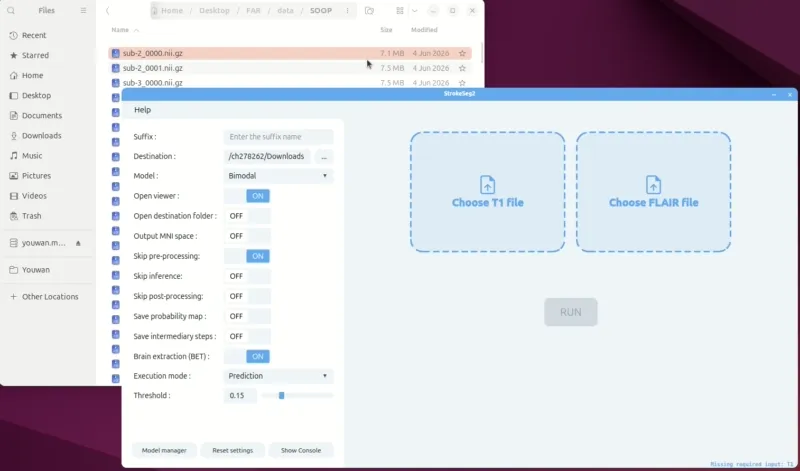

# User Guide

## Introduction

This application is designed to perform automated segmentation and detection of stroke lesions in brain MRI images. It provides both a graphical interface (GUI) and a command line interface (CLI) to facilitate user interaction, allowing you to process data, manage models, and review results efficiently.

## Graphical Interface

```{only} html

```

This section explains how to use the graphical interface (GUI) of the application.

### Launching the Application

The GUI can be launched either by double-clicking the executable or by running it from the command line without any arguments.

When opening the application, a pop-up window appears on the main screen:
```{warning}
 This application is for research purpose only !
```

You cannot use the application until you close this message by clicking "OK" or the close button. If you don’t want to see the message again, you can check the “Do not show again” option. If later you want to see it at startup, there is a “Restore warning window” option in the Options menu.

### Main Window
The main window is composed of a menu bar and, below it, a large frame containing several fields.

There are two modes available: *Prediction*, which is the default mode, and *Brain Extraction Only*.  
You can switch between them using the dropdown menu at the bottom of the window.

### Input and Output Management

In both modes, at the top of the window, you’ll find the input path, which is the only required field. You can either click on *Select input folder* or *Select input file* depending on the type of input you want to process. 

The application handles BIDS and not BIDS input directory and file. If you process a file located in a BIDS directory, the outputs will be saved in the *derivatives* folder. Otherwise, they will be placed in an *output* folder located in the parent directory of your file. If you process a directory, BIDS or not, outputs will be save in the *derivatives* folder. In prediction mode, the application processes subjects as follows : 
- With a T1/FLAIR model, only subjects that have both a T1 and a FLAIR image are processed
- With a mono-channel model, all subjects with a T1 image are processed
- When *Keep MNI* mode is enabled, MNI-preprocessed files are prioritized first, followed by brain-extracted files if available 
- When *Keep MNI* mode is disabled, brain-extracted files are prioritized, and MNI-preprocessed files are ignored.

**You just need to select the root BIDS folder, the application will automatically find and organize the files from both *rawdata* and *derivatives***

### Prediction Mode

Prediction Mode is used to perform automated segmentation of stroke lesions in the brain. This mode uses trained models to analyze input images and generate prediction results for each subject.

The *Suffix* field allows you to specify the suffix for the prediction output file.

The *Model* dropdown lets you choose the model. On the right, it shows whether the model uses only T1 or both T1 and FLAIR. If no models are available, a red message appears on the right, and you won't be able to run a prediction.

The *Open viewer* field lets you choose whether to open a viewer and select which viewer to use. The viewer will display the segmentation result for the first predicted subject. ITK-SNAP, FSLeyes, and medInria are the three viewers supported by the application. Only those installed on your machine will appear in the dropdown menu.

The *Output in MNI space* fields lets you choose whether you want to have the output in the MNI space or the subject space. You can’t have both at the same time. If you want MNI space, the app will look for the preprocessed MNI image. If it doesn’t find it, it will generate it during preprocessing.

### Brain Extraction Only Mode

Brain Extraction Only mode performs only the brain extraction step of preprocessing. The resulting brain-extracted images are saved in BIDS format, following the same output logic as in Prediction mode. The output files will use the suffix "BET" to indicate brain extraction.

### Running and Monitoring

Once the required fields are set (such as input path and model, if applicable), you can start the process by clicking the Run button. This applies to both Prediction and Brain Extraction Only modes. Information and log messages will be displayed to keep you updated on the progress. Please note that processing can take a significant amount of time. A Stop button will appear during execution, allowing you to interrupt the process if needed. Stopping may take several tens of seconds depending on the current progress.

### Options Menu

The following options are available from the Options menu in the menu bar at the top of the main window:

- **Save brain extracted image**: This checkbox is available only in Prediction mode. When enabled, it allows you to save the brain-extracted image during the prediction process.
- **Threshold**: Available only in Prediction mode. This option opens a window with a slider and a field, allowing you to adjust the segmentation threshold.
- **Save probability map**: This checkbox is available only in Prediction mode. When enabled, it allows you to save the probability map (before thresholding) during the prediction process.
- **Import a model**: Opens a window with three buttons: Select Model (to choose the model file), Import (to import the selected model), and Close (to close the window). A success message in green or an error message in red will be displayed. Only ONNX (.onnx) model files can be imported.

### Help Menu

The following options are available from the Help menu in the menu bar at the top of the main window:

- **Help**: Opens a window displaying the user documentation (this guide).
- **About**: Opens a window with the About section, which includes three parts:
  - **Developers**: Lists the developers involved in the project.
  - **Licence**: Provides information about the licenses.
  - **Publications**: Lists publications related to the application.

## Command Line Interface

This section explains how to use the application from the command line (CLI).

### Usage

The application is launched using the compiled executable for your system (e.g., `strokeseg2-app` on Linux/macOS, or `StrokeSeg2.exe` on Windows). On macOS, you may need to point to the binary inside the app bundle (e.g., `/Applications/strokeseg2-app.app/Contents/MacOS/strokeseg2-app`).

If no arguments are provided, the graphical interface will open by default. You can explicitly force the GUI to open by passing the `--gui` flag.

**Prediction Mode**: Segment and detect stroke lesions in brain MRI images. Requires the `--input` parameter using the `CHANNEL=path` format (e.g., `--input T1=/path/to/t1.nii.gz`). The `--model` option can be used to specify either the name of an installed model or the path to a model file.

**Brain Extraction Only Mode**: Use `--input` and `--only-preproc` to perform only the brain extraction step. 

**Model Management**:
- List available models using `--list-models`.

### Options

**General & Help:**
- `-h`, `--help`: Displays help on command-line options.
- `--help-all`: Displays help, including generic Qt options.
- `-v`, `--version`: Displays version information.
- `--gui`: Launch in GUI mode (with any pre-filled options you pass).

**I/O & Processing:**
- `--input`, `-i <input>`: Input MRI file using channel assignments. E.g., `T1=/path/t1.nii.gz`. This argument is repeatable for multi-channel models.
- `--output-dir`, `-o <outputDir>`: Manually specify an output directory.
- `--suffix`, `-s <suffix>`: Specify the output file suffix.

**Modeling & Inference:**
- `--model <model>`: Model name or absolute path to the `.onnx` file.
- `--list-models`: List the currently available models.
- `--threshold`, `-t <threshold>`: Set the segmentation threshold (e.g., `0.5`).

**Preprocessing & Pipeline Control:**
- `--only-preproc`: Run only the brain extraction step and stop.
- `--no-brain-extraction`: Skip brain extraction entirely (use this if your input images are already skull-stripped).
- `--skip-preproc`: Skip the preprocessing pipeline.
- `--skip-inference`: Skip the inference pipeline.
- `--skip-postproc`: Skip the postprocessing pipeline.

**Outputs & Logging:**
- `--save-inter-steps`: Save all intermediate preprocessing and postprocessing steps to the disk.
- `--keep-mni`: Save the output and process within the MNI space.
- `--pmap`: Save the raw probability map (before applying the threshold).
- `--verbose`: Enable verbose mode by setting the logging level to DEBUG.

### Monitoring and Logs
During execution, log messages are displayed in the terminal to keep you informed about progress, errors, and important information. Processing can take a significant amount of time depending on the data size and the pipeline options selected. Using the `--verbose` flag will output detailed diagnostic logs.
