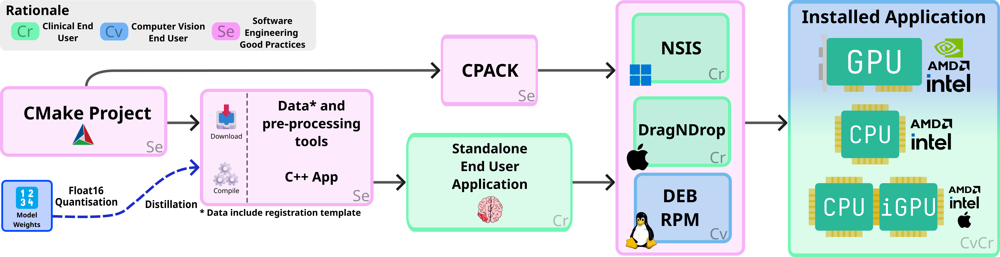

StrokeSeg2 Documentation
========================

.. warning::

   This application is for research purposes only!

.. toctree::
   :maxdepth: 2
   :caption: Contents:

   USER_GUIDE

Download
------------
   - `StrokeSeg2 installer (Windows, macOS, Linux) <https://github.com/empenn-stroke/StrokeSeg2/releases>`_
   - `StrokeSeg2 source code <https://github.com/empenn-stroke/StrokeSeg2>`_
Model Checkpoints are available here : `Zenodo <https://zenodo.org/records/18360630>`_

Software description at :cite:p:`mahe2026strokeseg2`.

Model description at :cite:p:`dimatteo2026`.

API Documentation
=================

- `C++ API Documentation (Doxygen) <api/index.html>`_

References
----------

.. bibliography::
